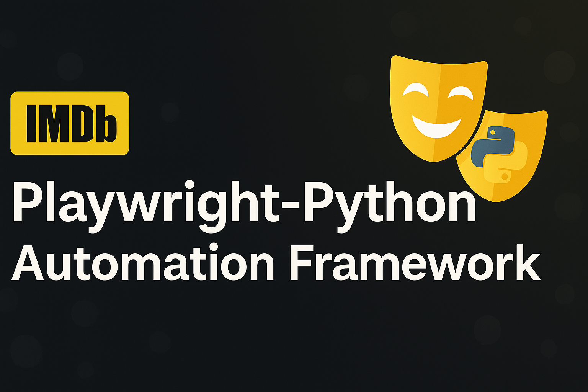
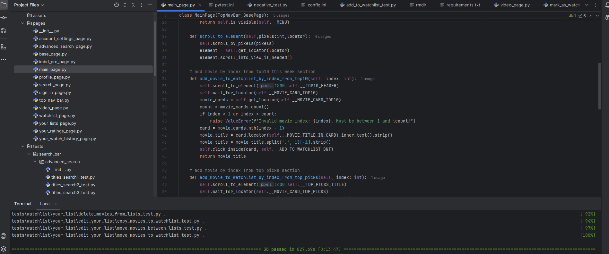
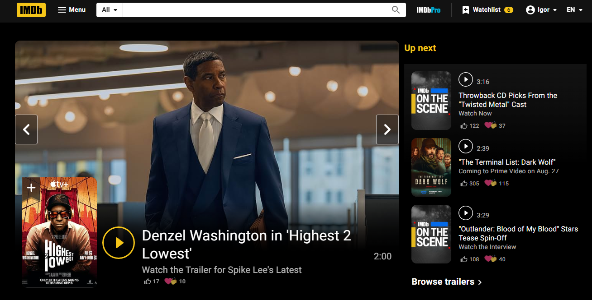

# 🎯 Playwright-Python Automation Framework




## 📝 Project Description

This is a world-class, modern automation testing framework built from scratch using **Python** and **Playwright**.  
It is designed for maximum readability, modularity, and real-world test coverage across complex UI flows.

## 🎯 Project Goal

The main goal of this project is to automate UI flows on the IMDb platform using Playwright, following best practices in automation design including the **Page Object Model (POM)** and Allure reporting integration.

## 🚀 Technologies Used

- 🐍 Python 3.10+
- 🎭 Playwright
- 🧪 Pytest
- 🧱 Page Object Model (POM)
- 📊 Allure Reports
- 🧩 pytest.ini, config.ini, requirements.txt

## 🛠️ Installation

```bash
git clone git@github.com:NekrasovIgor1/Playwright-Python.git
cd Playwright-Python
python -m venv .venv
source .venv/Scripts/activate  # Windows
pip install -r requirements.txt
```

## ▶️ Running Tests

```bash
pytest --alluredir=allure-results
allure serve allure-results
```

## 📁 Folder Structure

```
Playwright-Python/
├── pages/              # All page classes using POM
├── tests/              # All test cases
├── utils/              # Utility functions
├── allure/             # Allure reports
├── config.ini          # Configs (like login credentials)
├── pytest.ini          # Pytest configs
├── requirements.txt    # Dependencies
└── README.md
```

## ✅ What’s Tested

- Search functionality
- Login + negative login scenarios
- Watchlist management (add/move/delete titles)
- Rating movies and videos
- UI navigation (menu, banners, drawers)

## 📊 Reports and Dashboards

- [🔗 Allure Live Report](assets/allure.png)
- [🔗 Allure Packages](assets/allure-packages.png)

## 🏷️ Badges


## 🖼️ Screenshots

   


## 🙌 Call to Action

⭐ Star this repository if you find it useful!  
Feel free to submit issues, ideas or connect with me on [LinkedIn](https://www.linkedin.com/in/igor-nek)

---

🔗 **Project Repository**: [Playwright-Python](https://github.com/NekrasovIgor1/Playwright-Python)  

---

> The project was created as part of an automation course under the Automation College (Gal Matalon):  
> [https://automation.co.il/](https://automation.co.il/)
